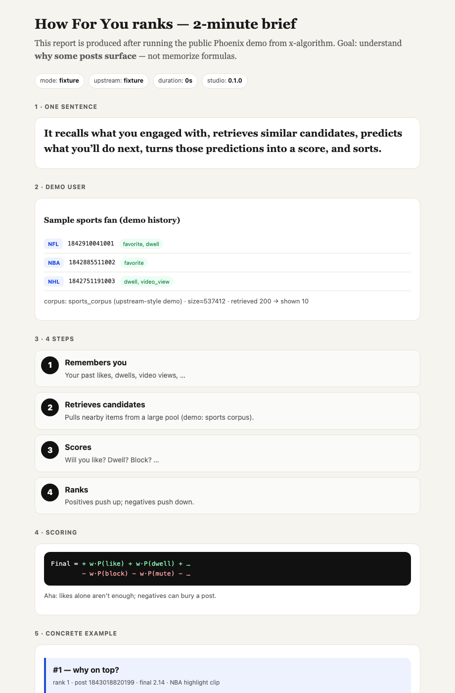
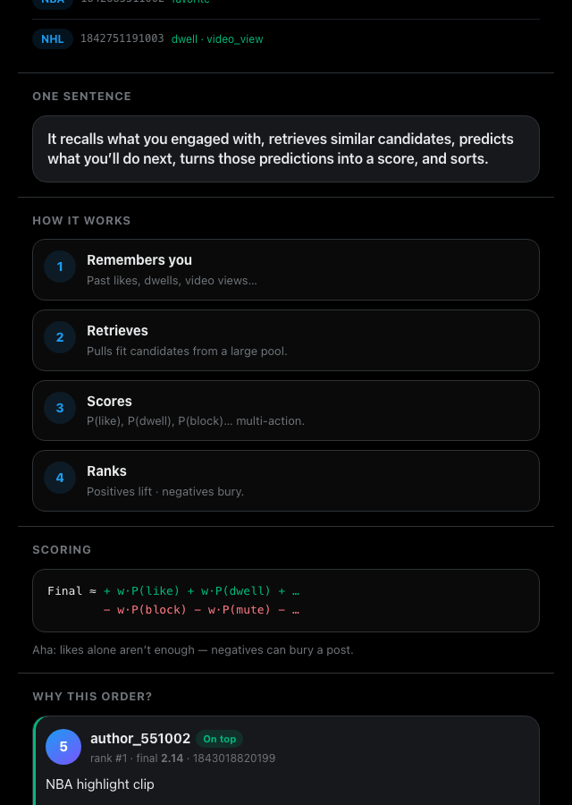

# x-algorithm-studio

**Run · Understand · Extend**

> One command to *see* how X’s **public** For You (Phoenix) demo ranks posts —  
> **or** one paste into Claude / Cursor / Codex / Grok for a **guided session**:  
> welcome → capabilities → questions, demo, or build.

Not affiliated with X or xAI.  
Does **not** reconstruct your live timeline or production weights.  
Built on [`xai-org/x-algorithm`](https://github.com/xai-org/x-algorithm) (Apache-2.0).  
**Language:** English only (docs, report UI, agent prompts) — global product.

Created by **Sabah Kemal** ([@sabahkemalll](https://x.com/sabahkemalll) on X) — see [`OWNER.md`](OWNER.md).

### Preview (offline aha report)

X-inspired dark UI · feed cards · ranked list.



<p align="center">
  
</p>

*Generated by `make demo-fixture` — plain-English walkthrough of retrieval → multi-action ranking.*

---

## Why this exists

[`xai-org/x-algorithm`](https://github.com/xai-org/x-algorithm) opened the For You stack to the world — but most people star it and never **run** or **feel** it (LFS, ~3GB artifacts, dense code).

**x-algorithm-studio** is a community layer on top:

| Goal | What you get |
|------|----------------|
| **Run** | Offline aha report in minutes; optional full mini Phoenix when artifacts are available |
| **Understand** | Plain-English report + curriculum (retrieval → multi-action rank → positives vs negatives) |
| **Extend** | Safe `extensions/` + `presets/`; agent host protocol so coding agents *teach then build* |

---

## Two doors

| Door | What you do | What you get |
|------|-------------|--------------|
| **Human** | `make demo-fixture` → `make open` | Aha HTML report (no 3GB download) |
| **Agent** | Paste [`agent/PROMPT_DROP_IN.md`](agent/PROMPT_DROP_IN.md) | **Product session**: welcome → what/why → expectations → capabilities → **Questions / Demo / Build** |

---

## Quick start (human, offline, ~2 minutes)

```bash
git clone https://github.com/sabahkemalcansu/x-algorithm-studio.git
cd x-algorithm-studio
make doctor
make demo-fixture
make open
```

Optional — see *why* #1 ranked:

```bash
make explain
```

### What the aha report teaches

- One-sentence mental model of For You-style ranking  
- 4 steps: **remember → retrieve → score → rank**  
- Concrete **#1 vs lower rank** (high dwell/like vs higher block risk)  
- Honest disclaimer: **public demo ≠ live X**  

---

## Agent session (the “drop this on an agent” product)

This is not “here’s a README, good luck.”  
Users paste one block; the agent must **host** them.

### Steps

1. Open this repo in Claude Code, Cursor, Codex, or Grok Build.  
2. Copy the prompt block from **[`agent/PROMPT_DROP_IN.md`](agent/PROMPT_DROP_IN.md)**.  
3. Paste into the agent and send.

### First reply must include (protocol)

Defined in [`agent/SESSION_PROTOCOL.md`](agent/SESSION_PROTOCOL.md):

1. **Welcome** — project name, owner + thanks ([`OWNER.md`](OWNER.md))  
2. **What this is / why it was built**  
3. **What you can do / what to expect**  
4. **Capability set** ([`docs/capabilities.md`](docs/capabilities.md))  
5. **Continue** — **Questions** · **Demo** · **Build**  

Gold-standard tone: [`agent/FIRST_TURN_EXAMPLE.md`](agent/FIRST_TURN_EXAMPLE.md).

### After the user picks a path

| Path | Agent does |
|------|------------|
| **Questions** | Teach from curriculum / scoring / capabilities |
| **Demo** | `make demo-fixture` (+ `make explain`), walk the report |
| **Build** | `make agent-smoke` → task under `extensions/` or `presets/` |

Deeper agent engineering loop: [`docs/agent-loop.md`](docs/agent-loop.md).  
Grasp bar: [`agent/eval/checklist.md`](agent/eval/checklist.md) (≥5/6).

```bash
make agent-smoke   # fixture report + ExplainScorer (CI path)
make explain       # teaching drivers for top ranks
```

---

## Commands cheat sheet

| Command | Purpose |
|---------|---------|
| `make doctor` | Environment check |
| `make demo-fixture` | Offline aha report (always works) |
| `make explain` | ExplainScorer → `out/latest/explain.json` |
| `make agent-smoke` | Fixture + explain (agent/CI green path) |
| `make report` | Re-render HTML from `results.json` |
| `make open` | Open `out/latest/report.html` |
| `make vendor` | Clone upstream `x-algorithm` |
| `make pull` | Cache Phoenix artifacts (~3GB, needs git-lfs) |
| `make demo-native` | Full mini-model pipeline when artifacts ready |
| `make demo` | Docker if available, else native |

Weight experiments (same probabilities, new order):

```bash
python3 extensions/scorers/reweight.py \
  --weights presets/weights/anti_negative.json
```

---

## Full Phoenix demo (optional, real mini model)

Needs **git-lfs**, disk for **~3GB** artifacts, and Python/`uv`:

```bash
make vendor
make pull
make demo-native
make open
```

If LFS fails, follow upstream `phoenix/README.md` inside `vendor/x-algorithm` after `make vendor`.

---

## Mental model (what you’re looking at)

```text
user engagement history
  → retrieve candidates (large pool → top-K)
  → predict many P(actions): like, dwell, block, …
  → Final ≈ Σ w_pos·P(pos) − Σ w_neg·P(neg)
  → ranked list + aha report / explain drivers
```

**Aha, not magic:** posts surface when predicted **positive** engagement is high and **negative** signals (block/mute/…) stay low — for *that* history.

Capability map (for humans and agents): [`docs/capabilities.md`](docs/capabilities.md).

---

## Repo layout

```text
OWNER.md              Creator credit for agent Welcome
AGENTS.md             Rules for coding agents
README.md             You are here

agent/
  PROMPT_DROP_IN.md   ← paste this into Claude/Cursor/Grok
  SESSION_PROTOCOL.md Mandatory first-turn host script
  FIRST_TURN_EXAMPLE.md
  tasks/              Graded practice (summarize, weights, …)
  eval/               Checklist + golden rubric

docs/
  curriculum.md       15-minute mental model
  scoring.md          Multi-action + negatives
  capabilities.md     What the stack can / cannot do
  agent-loop.md       Full agent engineering loop
  pitfalls.md         What not to claim

scripts/              doctor, pull, run, aha renderer
fixtures/             Offline sample_results.json
extensions/scorers/   explain.py, reweight.py
presets/users/        Example histories
presets/weights/      Teaching weight packs
vendor/               x-algorithm (after make vendor)
out/                  Generated reports (gitignored)
docker/               Fixture-friendly container entry
```

---

## What this is not

- Your personal live X For You feed  
- Production ranking weights from X  
- An official X / xAI product  
- A guaranteed virality / growth-hack playbook  

We teach **mechanism literacy** on the **public** demo surface.

---

## Marketing one-liner (X / launch)

> Tens of thousands starred the algorithm. Almost nobody runs it.  
> **x-algorithm-studio**: one command to *see* how ranking works —  
> or one paste so your coding agent *hosts* you, then helps you *extend* it.

---

## License

Apache-2.0 for this studio. Upstream `x-algorithm` remains under its Apache-2.0 terms; see [`NOTICE`](NOTICE).
